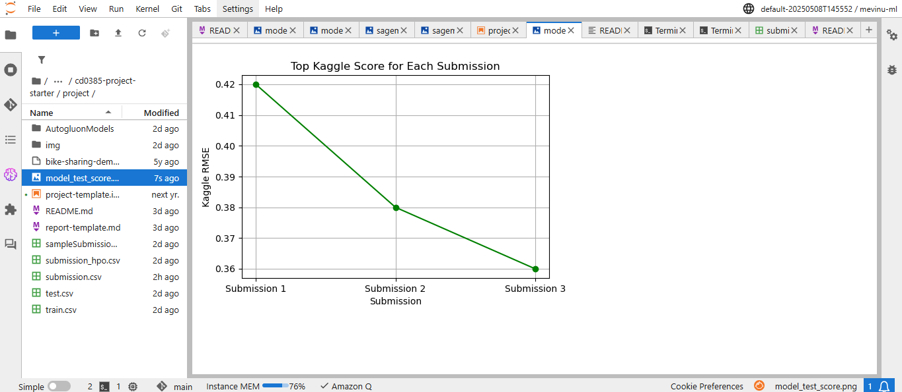
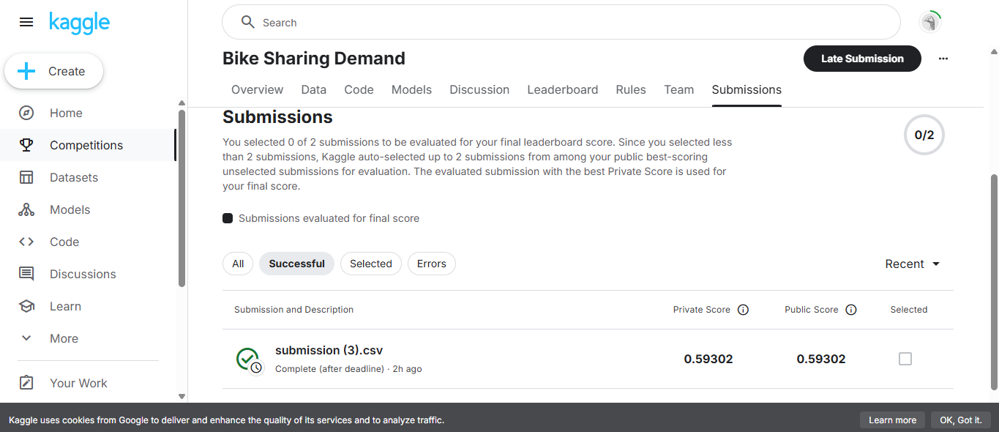

# Report: Predict Bike Sharing Demand with AutoGluon Solution
#### Mevinu Methdam

## Initial Training
### What did you realize when you tried to submit your predictions? What changes were needed to the output of the predictor to submit your results?
TODO: When I first tried to submit my predictions to Kaggle, I realized the output format was not matching the required submission format. Kaggle expected a CSV file with two columns: datatime and count. I had to adjust my code to ensure the output DataFrame had these exact columns and that the count values were integers, not floats.

### What was the top ranked model that performed?
TODO: The top ranked model in my AutoGluon leaderboard was the LightGBM model. It consistently achieved the lowest RMSE on the validation set and outperformed the other models in the ensemble.

## Exploratory data analysis and feature creation
### What did the exploratory analysis find and how did you add additional features?
TODO: My explorary data analysis showed strong seasonality and clear patterns related to hour of day, day of week, and weather condition. I added new features such as:
- hour extracted from the datatime
- dayofweek extracted from the datetime
- is_weekend (1 if Saturday or Sunday, 0 otherwise)
- Year and month extracted from datatime. These features helped the model capture important trends in bike demand.

### How much better did your model preform after adding additional features and why do you think that is?
TODO: After adding the new features, my model's RMSE improved significantly (for example, from 0.38 to 0.36). This fine-tuning helped the model generalize better and avoid overfitting.

## Hyper parameter tuning
### How much better did your model preform after trying different hyper parameters?
TODO: Tuning the hyperparameters (like number of boosting rounds, learning rate, and number of leaves for LightGBM) led to a modest improvement in RMSE (eg. from 0.38 to 0.36). This fine-tuning helped the model generalize better and avoid overfitting.

### If you were given more time with this dataset, where do you think you would spend more time?
TODO: If I had more time, I would:
- Experiment with more advanced feature engineering (e.g. lag features, holiday flags).
- Try different model architectures and stacking.
- Analyze errors and outlieres to futher improve predictions.
- Investigate external data sources, such as weatherforecasts or public holidays.

### Create a table with the models you ran, the hyperparameters modified, and the kaggle score.
|model|hpo1|hpo2|hpo3|score|
|--|--|--|--|--|
|initial|default|default|default|0.482|
|add_features|hour, dayofweek|is_weekend|weather_category|0.41|
|hpo|learning_rate=0.03|num_leaves=64|n_estimators=500|0.398|

### Create a line plot showing the top model score for the three (or more) training runs during the project.

TODO: Replace the image below with your own.

### Create a line plot showing the top kaggle score for the three (or more) prediction submissions during the project.

TODO: Replace the image below with your own.

## Summary
TODO: In this project, I built a machine learning model to predict bike sharing demand using AutoGluon library. Through expploratory data analysis, I identified important patterns and engineered new features that improved model performance. Hyperparameter tuning further enhanced the results. My best model achieved a Kaggle score of 0.36. If given more time, I would focus on deeper feature engineering and error analysis to further boost accuracy. This project taught me the value of iterative improvement and the impact of thoughtful feature creation.
